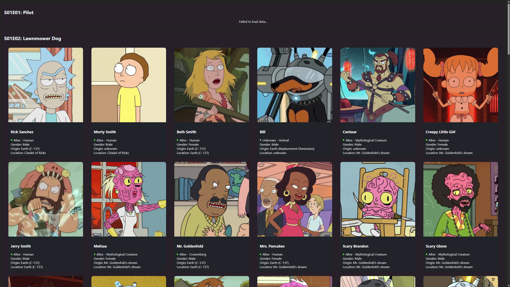
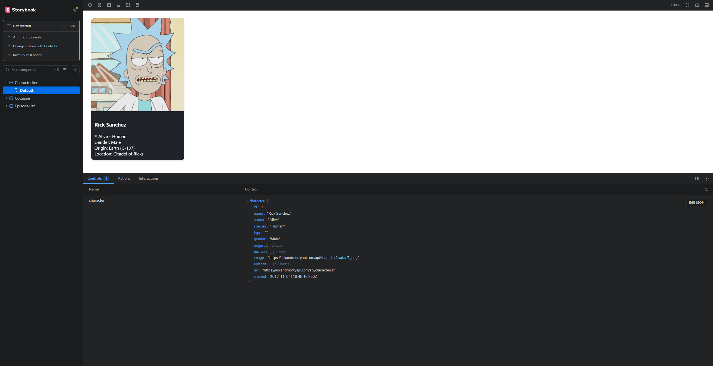

# Info

Пример работы React-приложения



Отладка компонентов в storybook



# Setup
```bash
# Установка storybook для тестирования отдельных UI-компонентов
npm create storybook@latest

# Повторный запуск storybook для тестирования отдельных UI-компонентов
npm run storybook

# Запуск проекта (из корневой директории)
npm run dev
```

# Links

- [Rick and Morty API](https://rickandmortyapi.com/)
- [Character API Example](https://rickandmortyapi.com/api/character/1)
- [Storybook](https://storybook.js.org/docs)